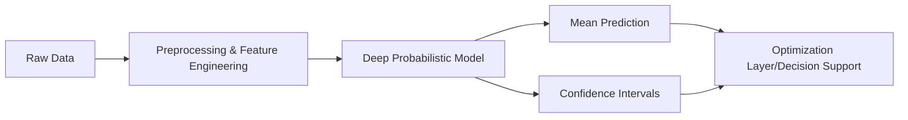

# Probabilistic ML Forecaster 📈

**Probabilistic-ML-Forecaster** is an advanced Machine Learning framework designed for uncertainty-aware time-series forecasting. Unlike point-estimate models, this framework provides a full probability distribution, enabling robust decision-making in supply chain and financial contexts.

Built by [David Baroncini](https://linkedin.com/in/davidbaroncini/), Senior AI Engineer.

---

## 🌟 Key Capabilities

- **Uncertainty Quantification:** Implements Deep Learning models with Gaussian Likelihood layers to predict mean and variance.
- **Probabilistic Metrics:** Evaluates performance using CRPS (Continuous Ranked Probability Score) and Quantile Loss.
- **Feature Engineering:** Automated lag generation, Fourier transforms for seasonality, and exogenous variable handling.
- **Enterprise Ready:** Modular architecture suitable for deployment in production environments.

## 🏗️ Architecture



## 🛠️ Technical Stack

- **Modeling:** PyTorch, Scikit-Learn
- **Data:** Pandas, NumPy, Scipy
- **Visualization:** Matplotlib, Seaborn
- **Metrics:** CRPS, Pinball Loss

## 🚀 Getting Started

### Installation
```bash
pip install -r requirements.txt
```

### Quick Start
```python
from forecaster.model import ProbabilisticLSTM
from forecaster.trainer import ForecasterTrainer

# Initialize model for uncertainty-aware forecasting
model = ProbabilisticLSTM(input_dim=10, hidden_dim=64)
trainer = ForecasterTrainer(model)

# Train and predict with 95% confidence intervals
forecast_dist = trainer.predict(test_data)
print(f"Mean: {forecast_dist.mean}, Sigma: {forecast_dist.stddev}")
```

## 📝 License
Distributed under the MIT License.
